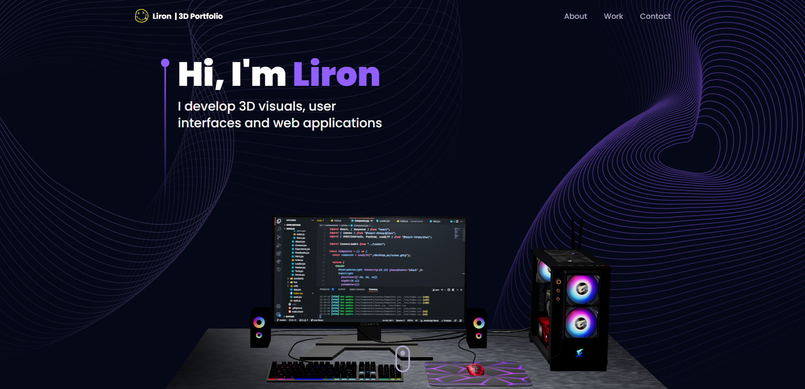

# Gal Harel — 3D Portfolio

A personal portfolio website built with React.js and Three.js, featuring 3D animations and a fully responsive design.



## Tech Stack

- [React.js](https://reactjs.org/) + [TypeScript](https://www.typescriptlang.org/)
- [Three.js](https://threejs.org/) / [@react-three/fiber](https://docs.pmnd.rs/react-three-fiber)
- [Framer Motion](https://www.framer.com/motion/)
- [Tailwind CSS](https://tailwindcss.com/)
- [Vite](https://vitejs.dev/)
- [EmailJS](https://www.emailjs.com/)

## Getting Started

### Prerequisites

- Node.js
- npm

### Installation

```bash
git clone https://github.com/galharel23/gal-portfolio.git
cd gal-portfolio
npm install
```

### Environment Variables

Create a `.env` file in the root directory:

```env
VITE_EMAILJS_SERVICE_ID=your_service_id
VITE_EMAILJS_TEMPLATE_ID=your_template_id
VITE_EMAIL_JS_ACCESS_TOKEN=your_access_token
```

### Run locally

```bash
npm run dev
```

Open [http://localhost:5173](http://localhost:5173) in your browser.

### Build

```bash
npm run build
```

## License

MIT
